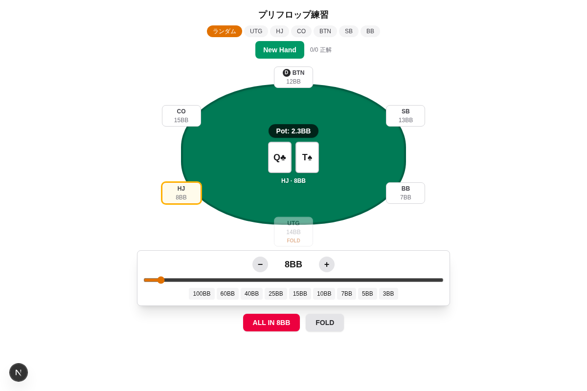
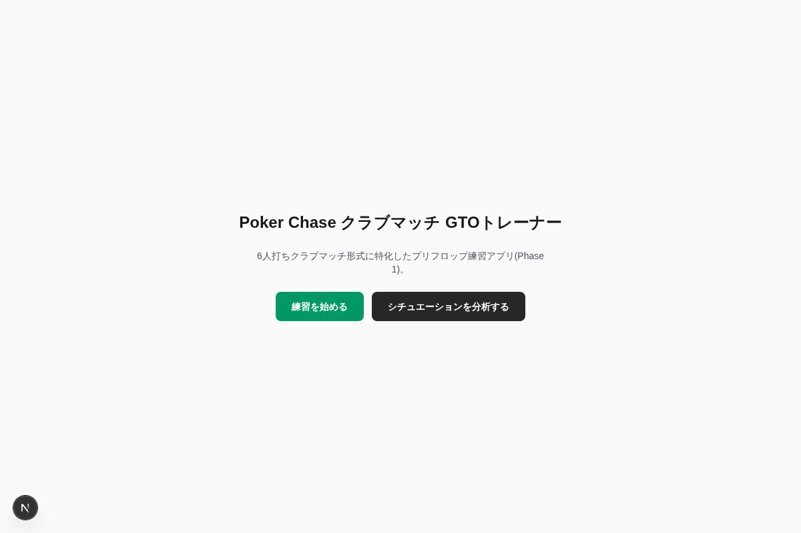
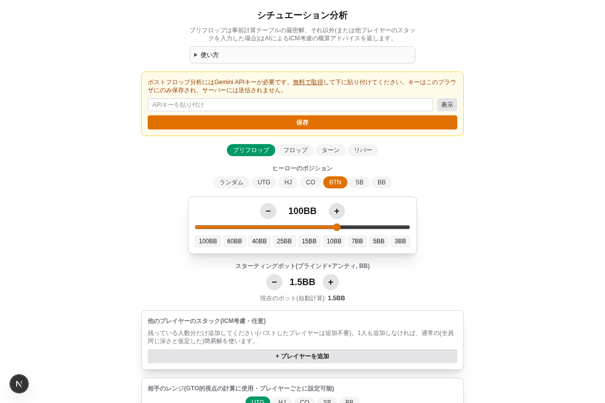

# Poker Chase クラブマッチ GTOトレーナー

6人打ちのクラブマッチ形式に特化した、プリフロップ戦略のトレーニング＆分析アプリです。

**🔗 Live Demo: [pokergtoapp-green.vercel.app](https://pokergtoapp-green.vercel.app)**



## これは何？

プリフロップの最適戦略（GTO）をクイズ形式で練習し、実際のハンドを自分で入力してAIにフィードバックをもらえるWebアプリです。現在は Phase 1（プリフロップ特化）として公開しています。

## 主な機能

### 🎯 練習モード（`/train`）
- **プリフロップ**: CFR（Counterfactual Regret Minimization）で事前計算したプリフロップソルバーの答えを元に、ランダムに配られたハンド・ポジション・スタック状況に対して最適アクションをクイズ形式で回答。回答するとソルバーの推奨頻度（レイズ/コール/フォールドの混合戦略）と答え合わせを表示。ポジション・スタック深度を指定してのハンド生成にも対応
- **ポストフロップ**: ランダムに生成されたフロップ・ターン・リバーいずれかの局面（プリフロップはオープン+コール・3ベット・マルチウェイ(3人参加→フロップで1人フォールド)のいずれかに単純化、以降はヘッズアップ）に対してアクションを選択すると、分析モードと同じエンジン（GTOベースライン＋Gemini APIによるエクスプロイト評価）でフィードバックを返す。プリフロップ側と違い事前計算された厳密解ではなく「参考値」としての表示（要Gemini APIキー）

### 🔍 分析モード（`/analyze`）
- ポジション・スタック・アクション履歴・ボードカードなど任意のシチュエーションを自分で組み立てて入力可能
- プリフロップはソルバーの計算結果、フロップ以降は Gemini API を使ったAIアドバイザーが状況を読み取り、推奨アクションと根拠を返す
- Gemini APIキーはブラウザのローカルストレージにのみ保存され、サーバーには送信されない（利用者自身のAPIキーが必要）
- 他のAIチャットに貼り付けて相談できるよう、状況をプロンプト化してコピーする機能も搭載（内部用のペルソナ/JSON出力指示は含まれず、ポジション・スタック・アクション履歴などプレイに関する情報のみ）

### 📚 ハンド履歴（`/history`、任意・要ログイン）
- 分析モードで結果が出た後「履歴に保存」を押すと、入力内容・解析結果・外部AI用プロンプートを1レコードとして保存できる
- ログインはメールアドレス宛のマジックリンク方式（パスワード不要）。データはSupabase（無料枠）にユーザーごとに保存され、他のブラウザ/端末からも同じアカウントで見返せる
- Supabase未設定の場合はこの機能だけが無効になり、練習・分析モードはそのまま使える（セットアップ手順は下記）

<details>
<summary>画面キャプチャを見る</summary>

| トップ | 分析モード |
|---|---|
|  |  |

</details>

## 技術スタック

| 領域 | 技術 |
|---|---|
| フレームワーク | Next.js 16 (App Router) / React 19 / TypeScript |
| スタイリング | Tailwind CSS v4 |
| 状態管理 | Zustand |
| バリデーション | Zod |
| AI連携 | Google Gemini API (`@google/genai`) |
| ハンド履歴(任意) | Supabase（Auth + Postgres、無料枠） |
| ロジック | 自前実装のハンド評価・エクイティ計算・CFRソルバー・ICM計算 |
| テスト | Vitest |

### アーキテクチャのポイント
- `src/engine/solver` : プリフロップ用のCFRソルバーとプッシュ/フォールドソルバー。`scripts/precompute-preflop.ts` で事前計算し、`src/data/solverOutput` にJSONとして格納することで実行時は瞬時に参照可能
- `src/engine/equity` : 7枚評価によるハンド強度・レンジエクイティ計算
- `src/engine/advisor` : Gemini APIへのプロンプト構築・レスポンスのスキーマ検証（Zod）を担当し、フロップ以降の状況判断を担う。`gtoBaseline.ts`のポットオッズ対エクイティ計算は分析モード・ポストフロップ練習モード両方から共有利用
- `src/engine/history` : 分析ページの入力状態からハンド履歴のスナップショットを組み立てる純粋関数（`src/state/historyStore.ts` から利用）
- `src/domain` : カード・シナリオ・テーブルなどのドメインロジックをUIから分離
- `src/lib/supabase` : Supabaseブラウザクライアント。環境変数未設定時は履歴機能のみ無効化され、他機能はそのまま動作する

## セットアップ

```bash
npm install

# プリフロップソルバーの事前計算（初回のみ／solverOutput更新時）
npm run precompute:preflop

# 開発サーバー起動
npm run dev
```

[http://localhost:3000](http://localhost:3000) を開くと確認できます。分析モードでポストフロップのAIフィードバックを使うには、[Google AI Studio](https://aistudio.google.com/apikey) で取得した無料のGemini APIキーをアプリ内の設定から入力してください。

## 履歴機能のセットアップ（任意、Supabase）

ハンド履歴（`/history`）を使わないなら、この手順は不要です。使う場合のみ以下を行ってください。

1. [Supabase](https://supabase.com) で無料アカウント・プロジェクトを作成する
2. プロジェクトの SQL Editor で [`supabase/schema.sql`](supabase/schema.sql) の内容を実行する（`hand_records` テーブルとRLSポリシーが作成される）
3. Authentication → URL Configuration で、Site URL とRedirect URLsに開発用・本番用のURL（例: `http://localhost:3000`、Vercelのデプロイ先URL）を登録する（マジックリンクのログインに必要）
4. Project Settings → API から `Project URL` と `anon public` キーを控える
5. ルートに `.env.local` を作成し、[`.env.local.example`](.env.local.example) を参考に `NEXT_PUBLIC_SUPABASE_URL` / `NEXT_PUBLIC_SUPABASE_ANON_KEY` を設定する（Vercelにデプロイする場合はProject SettingsのEnvironment Variablesにも同じ2つを設定して再デプロイする）
6. Authentication → Emails → Magic Link のテンプレートに `{{ .Token }}` を追記する（例: `<p>{{ .Token }}</p>` を本文に追加）。ホーム画面に追加(PWA)して使う端末では、メール内のリンクがPWA自体ではなく別のブラウザで開いてしまいログインが反映されないことがあるため、代わりにこのコードをアプリ内に直接入力してログインできるようにしている（`AuthPanel.tsx`）。この手順を行わないとコードがメールに載らず、リンク方式のみ使える状態になる

これで `/history` ページからメールアドレスでログインし、分析結果を保存できるようになります。

## テスト

```bash
npm run test
```

ハンド評価・エクイティ計算・ポットオッズ・ICM・アドバイザーのプロンプト/スキーマなど、コアロジックをVitestでカバーしています。

## デプロイ

[Vercel](https://vercel.com) にデプロイ済みです。Next.jsプロジェクトのため `vercel` にリポジトリを接続するだけでそのままデプロイできます。
